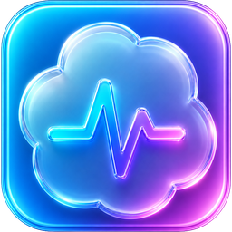

# CodexPulse

A small macOS menu bar app for keeping an eye on your Codex rate limits.

CodexPulse sits in the top bar and shows your current 5-hour and weekly Codex quota remaining, so you can glance at it without opening the Codex app settings menu.



## What It Shows

- 5-hour limit remaining
- Weekly limit remaining
- Reset time or reset date
- Current Codex plan type
- A stale/cached state when Codex is temporarily unavailable

You can choose how compact the top-bar display should be:

- Both: `5h 91% W 90%`
- 5h only: `5h 91%`
- Weekly only: `W 90%`

## Install

1. Download `CodexPulse-macos-arm64.zip` from the latest GitHub release.
2. Unzip it.
3. Drag `CodexPulse.app` into your `Applications` folder.
4. Open it once.

Because this early release is ad-hoc signed, macOS may block the first launch. If that happens, right-click `CodexPulse.app`, choose **Open**, then confirm. After that, it opens normally.

## Using CodexPulse

After launch, CodexPulse appears in your macOS menu bar as a small pulse-cloud icon with your selected quota text beside it.

Open the menu to:

- refresh the value immediately
- open Preferences
- turn Launch at Login on or off
- check when each limit resets
- check for updates
- quit the app

## Preferences

CodexPulse includes a small Preferences window for the things you may want to tune:

- choose whether the top bar shows both windows, 5h only, or weekly only
- show remaining percent, used percent, or both
- refresh every 30 seconds, 60 seconds, or 5 minutes
- opt in to low-limit and stale-data notifications
- review Diagnostics with source, cache, last refresh, and last error details

Notifications are off by default. If you enable them, macOS will ask for permission the first time.

## Privacy

CodexPulse runs locally on your Mac.

It reads your Codex rate-limit information from the local Codex app helper and does not send your data anywhere. If Codex is not available for a moment, CodexPulse shows the last successful reading and marks it as cached/stale in the menu.

## Requirements

- macOS 13 or newer
- Apple Silicon Mac
- Codex installed at `/Applications/Codex.app`

## For Developers

Build and package locally:

```sh
swift test
scripts/build-release.sh
scripts/package-zip.sh
```

The app bundle and zip are created in `dist/`.

Optional notarization support can be added later through `scripts/notarize.sh` once a Developer ID certificate is available.
